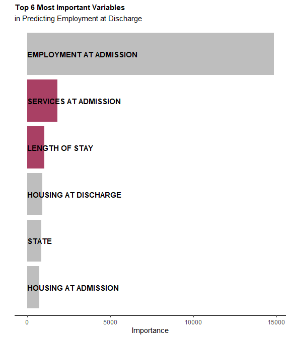
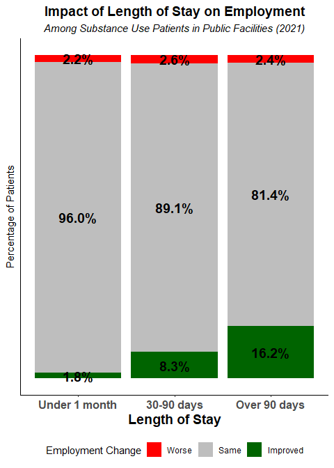
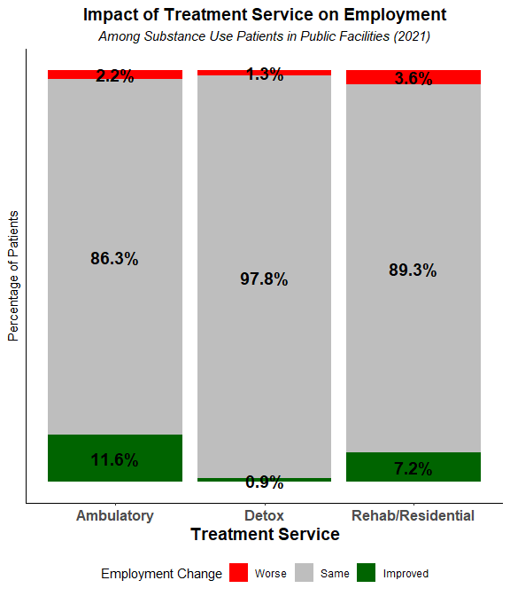

Predict Substance Use Treatment Impact on Employment Outcome
================
Avianna Bui

My research question centers on exploring the impact of substance use
treatment on employment outcome after discharge for substance use
patients in public-funded facilities.

## Data Loading

``` r
df <- get(load("tedsd_puf_2021_r.RData")) %>%
  mutate(across(everything(), haven::as_factor))
```

## Building a Random Forest

### Data Transformation for Random Forest Model

``` r
ml_data <- df %>%
  select(c(EDUC, MARSTAT, RACE, ETHNIC, AGE, GENDER, VET, EMPLOY, EMPLOY_D, LIVARAG_D, LIVARAG, FREQ1_D, FREQ1, FRSTUSE1, PSOURCE, DSMCRIT, STFIPS, PSYPROB, HLTHINS, NOPRIOR, ARRESTS_D, LOS, SERVICES, SUB1, SUB2, SUB3, FREQ_ATND_SELF_HELP_D, METHUSE, REASON)) %>%
  recode_as_na(value = -9) %>%
  drop_na() %>%
  filter(!EMPLOY == "Not in labor force") %>% # filter out people not in labor force
  filter(!EMPLOY_D == "Not in labor force") %>% 
  filter(REASON == "Treatment completed") %>% # keep only people who completed treatment
  select(-c(REASON)) %>%
  mutate(EMPLOY = if_else(EMPLOY == "Unemployed", "Unemployed", "Employed")) %>%
  mutate(EMPLOY_D = factor(if_else(EMPLOY_D == "Unemployed", "Unemployed", "Employed"))) %>%
  mutate(SUB2 = factor(if_else(SUB2 == "None", "N", "Y"))) %>%
  mutate(SUB3 = factor(if_else(SUB3 == "None", "N", "Y")))
```

### Random Forest Model Specification

``` r
set.seed(1111)
rf_spec <- rand_forest() %>%
  set_engine(engine = 'ranger') %>% 
  set_args(mtry = NULL, 
           trees = 500, 
           min_n = 2,
           probability = FALSE, 
           importance = 'impurity') %>% 
  set_mode('classification') 

data_rec <- recipe(EMPLOY_D ~ ., data = ml_data) # predict employment at discharge

data_wf <- workflow() %>%
  add_model(rf_spec) %>%
  add_recipe(data_rec)

rf_fit <- fit(data_wf, data = ml_data)

rf_fit
```

    ## ══ Workflow [trained] ══════════════════════════════════════════════════════════
    ## Preprocessor: Recipe
    ## Model: rand_forest()
    ## 
    ## ── Preprocessor ────────────────────────────────────────────────────────────────
    ## 0 Recipe Steps
    ## 
    ## ── Model ───────────────────────────────────────────────────────────────────────
    ## Ranger result
    ## 
    ## Call:
    ##  ranger::ranger(x = maybe_data_frame(x), y = y, num.trees = ~500,      min.node.size = min_rows(~2, x), probability = ~FALSE, importance = ~"impurity",      num.threads = 1, verbose = FALSE, seed = sample.int(10^5,          1)) 
    ## 
    ## Type:                             Classification 
    ## Number of trees:                  500 
    ## Sample size:                      56197 
    ## Number of independent variables:  27 
    ## Mtry:                             5 
    ## Target node size:                 2 
    ## Variable importance mode:         impurity 
    ## Splitrule:                        gini 
    ## OOB prediction error:             7.41 %

### Model Evaluation

> Result: On average, we can correctly predict employment at discharge
> for new substance use patients outside the datasets around 92.6% of
> the times

``` r
rf_OOB_output <- function(fit_model, model_label, truth){
    tibble(
          .pred_Unemployed = fit_model %>% extract_fit_engine() %>% pluck('predictions'), #OOB predictions
          EMPLOY_D = truth,
          label = model_label
      )
}

output <- rf_OOB_output(rf_fit, "test", ml_data %>% pull(EMPLOY_D))

output %>% 
    accuracy(truth = EMPLOY_D, estimate = .pred_Unemployed) # print accuracy
```

    ## # A tibble: 1 × 3
    ##   .metric  .estimator .estimate
    ##   <chr>    <chr>          <dbl>
    ## 1 accuracy binary         0.926

### Feature Importance

> Result: An individual’s employment status at admission holds the
> highest predictive ability to help predict employment at discharge,
> followed by treatment services type at admission and length of stay,
> which are the 2 treatment-related variables I will focus on examining
> in my visualization. Housing status at discharge and admission, as
> well as the clients’ state also have high predictive power

``` r
rf_fit %>%
    extract_fit_engine() %>%
    vip(num_features = 6, mapping = aes(fill = .data[["Variable"]])) +
    scale_fill_manual(values = c("grey", "grey", "grey" ,"#A94064" ,"#A94064" ,"grey" )) +
    labs(title = "Top 6 Most Important Variables ",
         subtitle = "in Predicting Employment at Discharge") +
    theme_classic() +
    theme(legend.position = "none",
          plot.title = element_text(face = "bold", size = 11),
          axis.text.y = element_blank(),     
          axis.ticks.y = element_blank(),    
          axis.line.y = element_blank())+    
    geom_text(aes(label = c("EMPLOYMENT AT ADMISSION",
                            "SERVICES AT ADMISSION",
                            "LENGTH OF STAY",
                            "HOUSING AT DISCHARGE",
                            "STATE",
                            "HOUSING AT ADMISSION"),
                            y = 0), hjust = 0, color = "black", size = 4, fontface = "bold")
```

<!-- -->

## Data Visualization

In this section, I visualize changes in patients’ employment outcome
with respect to the two most important treatment-related factors: length
of stay in treatment facilities and treatment services at admission.

### Data Transformation

``` r
df_viz <- df %>%
  select(EMPLOY, EMPLOY_D, LOS, REASON, SERVICES) %>%
  filter(REASON == "Treatment completed") %>% # keep only patients who completed treatment
  filter(!EMPLOY %in% c("-9", "Not in labor force")) %>%
  filter(!EMPLOY_D %in% c("-9", "Not in labor force")) %>%
  mutate(EMPLOYMENT = if_else(EMPLOY == "Unemployed", "Unemployed", "Employed")) %>%
  mutate(EMPLOYMENT_D = if_else(EMPLOY_D == "Unemployed", "Unemployed", "Employed")) %>%
  mutate(lengthOfStay = case_when(as.numeric(LOS) <= 30 ~ "Under 1 month",
                                  LOS %in% c("31 to 45 days","46 to 60 days","61 to 90 days") ~ "30-90 days",
                                  LOS %in% c("91 to 120 days", "121 to 180 days", "181 to 365 days", "More than a year") ~ "Over 90 days")) %>%
  mutate(lengthOfStay = fct_relevel(lengthOfStay, c("Under 1 month", "30-90 days", "Over 90 days"))) %>%
  mutate(EMPLOYMENT_CHANGE = case_when((EMPLOYMENT_D == "Unemployed" & EMPLOYMENT == "Unemployed") |  (EMPLOYMENT_D == "Employed" & EMPLOYMENT == "Employed") ~ "Same",
                             EMPLOYMENT_D == "Unemployed" & EMPLOYMENT == "Employed" ~ "Worse",
                             EMPLOYMENT_D == "Employed" & EMPLOYMENT == "Unemployed" ~ "Improved")) %>%
  mutate(EMPLOYMENT_CHANGE = fct_relevel(EMPLOYMENT_CHANGE, c("Improved", "Same", "Worse"))) %>%
  mutate(SERVICES = case_when(SERVICES %in% c("Detox, 24-hour, hospital inpatient", "Detox, 24-hour, free-standing residential") ~ "Detox",
                              SERVICES %in% c("Rehab/residential, hospital (non-detox)", "Rehab/residential, short term (30 days or fewer)", "Rehab/residential, long term (more than 30 days)") ~ "Rehab/Residential", 
                              SERVICES %in% c("Ambulatory, intensive outpatient", "Ambulatory, non-intensive outpatient", "Ambulatory, detoxification") ~ "Ambulatory"))
```

### Visualization: Length of Stay & Employment Outcome

> Result: The employment outcome for the majority of patients after
> treatment remains similar to their employment status at admission.
> Nonetheless, longer length of stay demonstrates a positive
> relationship with employment outcome, since unemployed people at
> admission with treatment length over a month, especially those with
> over 90 days of stays, are more likely to become employed at
> discharge.

``` r
df_viz %>%
  count(lengthOfStay, EMPLOYMENT_CHANGE) %>%
  group_by(lengthOfStay) %>%
  mutate(proportion = n / sum(n)) %>%
  mutate(EMPLOYMENT_CHANGE = factor(EMPLOYMENT_CHANGE, levels = c("Worse", "Same", "Improved"))) %>%
  ggplot(aes(x = lengthOfStay, y = proportion, fill = EMPLOYMENT_CHANGE)) +
  geom_bar(stat = "identity", position = "fill") +
  geom_text(aes(label = scales::percent(proportion, accuracy = 0.1)),
            position = position_fill(vjust = 0.5), size = 5, fontface = "bold") +
  labs(title = "Impact of Length of Stay on Employment",
       subtitle = "Among Substance Use Patients in Public Facilities (2021)",
       x = "Length of Stay",
       y = "Percentage of Patients",
       fill = "Employment Change") +
  scale_fill_manual(values = c("Improved" = "darkgreen", "Same" = "gray", "Worse" = "red")) +
  theme_classic() +
  theme(legend.position = "bottom",
        axis.text.y = element_blank(),
        axis.ticks.y = element_blank(),
        plot.title = element_text(face = "bold", size = 14, hjust = 0.5),
        plot.subtitle = element_text(face = "italic", hjust = 0.5, size = 11),
        axis.title.x = element_text(size = 14, face = "bold"),
        axis.text.x = element_text(size = 12, face = "bold"))
```

<!-- -->

### Visualization: Treatment Services at Admission & Employment Outcome

> Result: People admitted to ambulatory care setting are more likely to
> improve their employment outcome after treatment. Meanwhile, a higher
> proportion of clients admitted to rehab/residential treatment setting
> turns unemployed after their discharge. We hypothesize that this
> happens due to the fact that the inpatient nature of rehab/residential
> treatment requires clients to skip work, coupled with a lack of
> opportunities to network and interview for new jobs, causes clients to
> lose their employment and unable to find new jobs

``` r
df_viz %>%
  count(SERVICES, EMPLOYMENT_CHANGE) %>%
  group_by(SERVICES) %>%
  mutate(proportion = n / sum(n)) %>%
  mutate(EMPLOYMENT_CHANGE = factor(EMPLOYMENT_CHANGE, levels = c("Worse", "Same", "Improved"))) %>%
  ggplot(aes(x = SERVICES, y = proportion, fill = EMPLOYMENT_CHANGE)) +
geom_bar(stat = "identity", position = "fill") +
  geom_text(aes(label = scales::percent(proportion, accuracy = 0.1)),
            position = position_fill(vjust = 0.5), size = 5, fontface = "bold") +
  labs(title = "Impact of Treatment Service on Employment",
       subtitle = "Among Substance Use Patients in Public Facilities (2021)",
       x = "Treatment Service",
       y = "Percentage of Patients",
       fill = "Employment Change") +
  scale_fill_manual(values = c("Improved" = "darkgreen", "Same" = "gray", "Worse" = "red")) +
  theme_classic() +
  theme(legend.position = "bottom",
        axis.text.y = element_blank(),
        axis.ticks.y = element_blank(),
        plot.title = element_text(face = "bold", size = 14, hjust = 0.5),
        plot.subtitle = element_text(face = "italic", hjust = 0.5, size = 11),
        axis.title.x = element_text(size = 14, face = "bold"),
        axis.text.x = element_text(size = 12, face = "bold"))
```

<!-- -->
