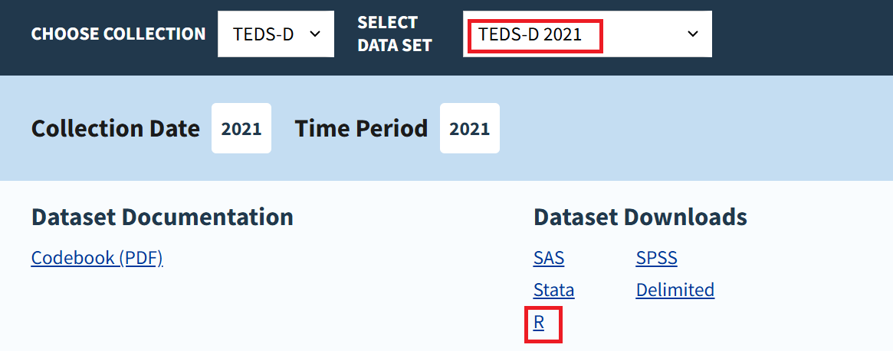

# How Substance Abuse Treatment Impacts Quality of Life in Public-Funded Facilities
###### Presenters: Avianna Bui, Ethan Caldecott, Miles Libbey
###### Project Area: Healthcare & Psychology

Our research question centers on examining how treatment-related factors influence quality of life outcomes, from admission to discharge, in public substance abuse facilities. By identifying key treatment-related factors that impact the quality of life for individuals undergoing substance use treatment in public facilities, we want to potentially pinpoint means or approaches to improve the efficacy of substance use treatment to different needs. Ideally, understanding the mechanisms/relationship between treatment and life outcomes can improve long-term recovery and relapse-prevention prospects for substance abuse patients.

### Structure of the Repository

This Github Repository includes a Final Narrative markdown file, with information about our research question, data context & download instructions, overall interpretations, limitations & future directions of our project. Each analysis and model for each quality of life outcome is included in its own .rmd file, which can be found in this repository. To view our codes, analyses, and visualizations, download our .rmd. files and run it in your RStudio Desktop. 

### Instructions to Download the Dataset

The dataset we use in our analysis is the Substance Abuse and Mental Health Services Administration (SAMHSA)’s Treatment Episode Data Set in 2021, which can be accessed at this link: https://www.samhsa.gov/data/data-we-collect/teds/datafiles?puf_id=47368&data_collection=1022. To download the dataset, select “TEDS-D 2021” for “Choose a dataset” as indicated in the image below, and click on the download link for R to download the dataset in .rdata format.

### Packages to install in R

The following code chunk includes the required R packages needed to run our analyses. To install these packages, copy the following code chunk and run it in your RStudio console
