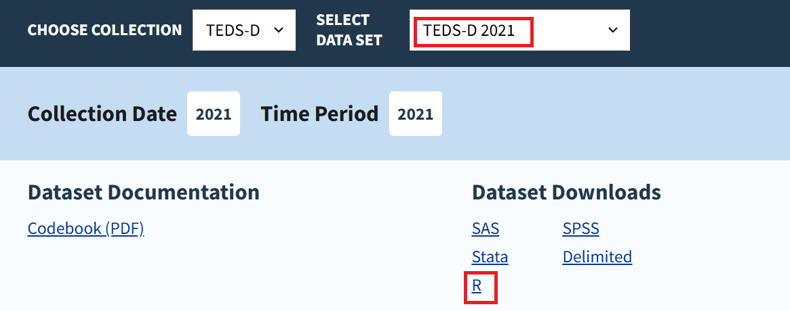

How Substance Abuse Treatment Impacts Quality of Life in Public-Funded
Facilities
================
Avianna Bui, Ethan Caldecott, Miles Libbey

##### Project Area: Healthcare & Psychology

## Research Question & Motivation

Our research question centers on examining how treatment-related factors
influence quality of life outcomes, from admission to discharge, in
public substance abuse facilities. By identifying key treatment-related
factors that impact the quality of life for individuals undergoing
substance use treatment in public facilities, we want to potentially
pinpoint means or approaches to improve the efficacy of substance use
treatment to different needs. Ideally, understanding the
mechanisms/relationship between treatment and life outcomes can improve
long-term recovery and relapse-prevention prospects for substance abuse
patients.

## Data Source & Description

### Instructions on Downloading the Data

The dataset we use in our analysis is the Substance Abuse and Mental
Health Services Administration (SAMHSA)’s Treatment Episode Data Set in
2021, which can be accessed at this link:
<https://www.samhsa.gov/data/data-we-collect/teds/datafiles?puf_id=47368&data_collection=1022>.
To download the dataset, select “TEDS-D 2021” for “Choose a dataset” as
indicated in the image below, and click on the download link for R to
download the dataset in .rdata format.

### Data Context

Our dataset is SAMHSA’s Treatment Episode Data Set in 2021, which
includes client-level data of patients aged 12 or older who undergoes
treatment in public-affiliated substance abuse facilities. While
different states may have different operational regulations for these
facilities, most facilities in the dataset receives government aid,
whether that be an official state rehabilitation facility to a community
clinic.

The original dataset has in total around 1.3 million records with 76
variables, coding every variable as a numeric category, with -9
representing missing, invalid, or “other” data, while numbers from 1 to
n representing the various levels in each category. For the purpose of
our analysis, we only keep clients who have completed their treatment in
the dataset to be able to reliably infer the treatment impact on
clients.

Of the 76 variables in the dataset, we subsetted it to just 28 variables
based on what we theorize to have a high explanatory power on clients’
quality of life based on conversations with experts in an effort to
capture a wide scope of impact. The variables correspond to 4
categories:

1.  **Demographic factors**: Education, Race, Marital Status, etc.

2.  **Treatment-related factors**: what substances clients use, how
    frequently, when they first started using, their length of stay, and
    reason for leaving, etc. Treatment-related variables referred to
    anything that provided insight into what happened during a client’s
    stay. We focus on the treatment-related variables with strong
    predictive power on life outcomes of patients since our research
    questions try to examine which treatment factors might help improve
    the quality of life in patients

3.  **Other non-treatment variables** such as clients’ mental health
    diagnoses and secondary & tertiary substance use. It should be noted
    that SUB2 and SUB3, the 2 variables listing a client’s secondary and
    tertiary substances, were converted into binary variables based on
    whether a substance was listed in that category. We primarily focus
    on the primary substance the client was diagnosed with since we
    learned from our experts that treatment plans, especially in public
    clinical settings, mostly focus on treating the primary substance
    diagnoses rather than any supplemental ones.

4.  **Outcome variables**: housing, employment status, and frequency of
    substance use at admission and discharge. Our outcome variables were
    the dataset’s most tangible life outcome variables, each indicating
    a different aspect of life before and after a client’s stay in the
    facilities.

## Results

The individual result and interpretations of our project in each quality
of life indicators (frequency of use, housing status, and employment
status at discharge) are included in corresponding .rmd files included
in the Github repository.

**Overall summary of results**:

## Limitations

Due to differences in state policies, with some states regulating
private agencies or correctional facilities while others don’t, the
demographic and treatment-related factors might differ across states,
which has the potential to impact our research result. Second, our
quality of life indicators are limited to the time periods near clients’
admission or discharge point, so our analysis cannot take into account
changes in quality of life after treatment in longer terms. In addition,
since there are no data on the specific treatment each individual
receives, our research are limited regarding which specific treatment
conditions will have a significant impact on quality of life outcome
post-discharge.

## Future Directions
